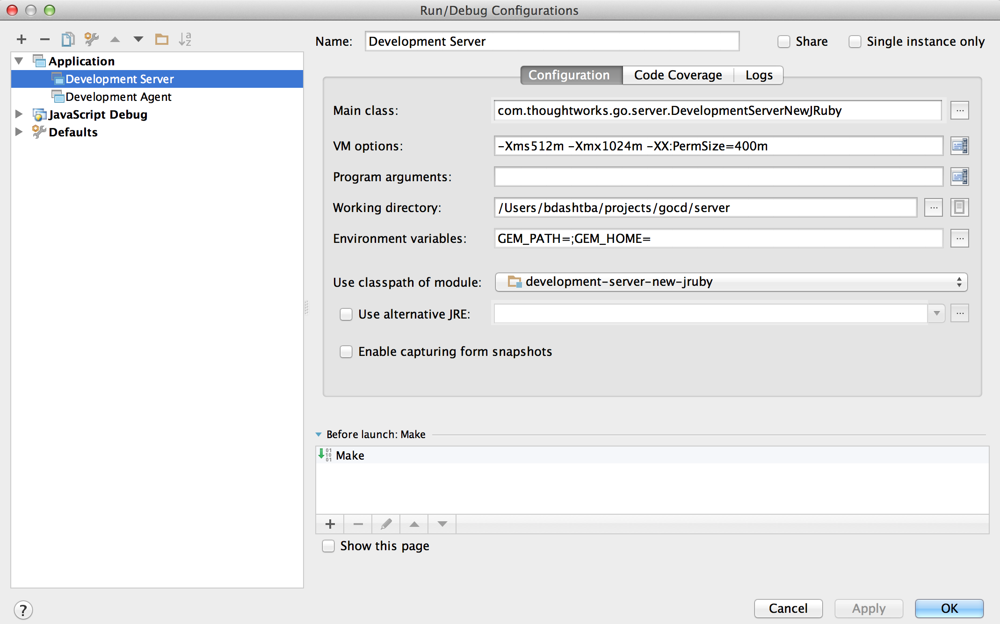
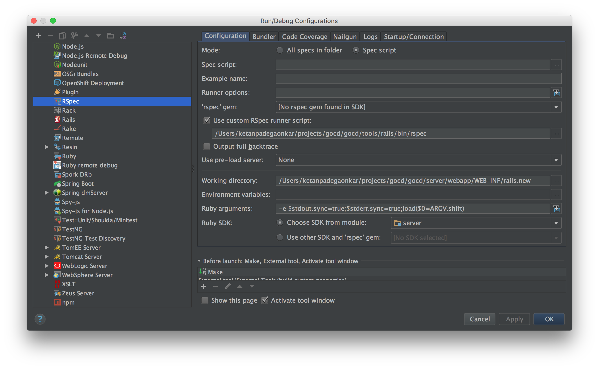

## 2.1 Setting up your development environment

### 2.1.1 Get the code and run a local build

GoCD requires the following software packages to build

-   JDK 7 (OpenJDK or Oracle)
-   Git (1.7+)
-   Maven (3.1.1+)
-   NodeJS (>=0.10)
-   Ruby (>= 1.9.3), optional

Assuming the codebase is cloned into **~/projects/go**, you need to execute the
following commands to build GoCD

```bash
~/projects/go$ unset GEM_HOME GEM_PATH
~/projects/go$ ./gradlew clean agentGenericZip serverGenericZip
```

After a successful build, the build artifacts are generated inside a directory
named "**target**" in the working directory. The output directory contains JARs
along with the packaged ZIP installer for GoCD Server and GoCD Agent.

```bash
~/projects/go$ ls target
agent
agent-bootstrapper
...
go-agent-14.1.0
go-server-14.1.0
...
util
```

### 2.1.2 Setup IntelliJ - to develop quicker

If you have IntelliJ IDEA configured, you can, optionally, use it to build GoCD.

Prior to build via the IDE, we would have to prepare the working directory by copying the database deltas to the
configured location. You can achive this by runnning the below command in the working directory:

```bash
~/projects/go$ ./gradlew clean prepare fatJar -PfastBuild
```

After the preparation phase has succeeded, 

- Open the project in IDEA
- Build -> Rebuild project

### <a name="dev-server-idea"></a>2.1.3 Running Development Server via IntelliJ IDEA

When developing using IntelliJ IDEA, it is always convenient to run the GoCD Server in *development mode*. Apart from the convenience, you also get

- Live debugging
- Faster feedback
- Hotswapping changes while the JVM is up

The IDEA **Application** run-configuration can be setup using the values below:

```
Name: Development Server
Main Class: com.thoughtworks.go.server.DevelopmentServer
VM options: -Xms512m -Xmx1024m -XX:PermSize=400m
Working directory: <project-directory>/server
Environment variables: GEM_PATH=;GEM_HOME=;
Use classpath of module: development-server
```

Configuring IntelliJ IDEA *run-configuration*


Running *Development Server* from IntelliJ IDEA


### 2.1.4 Running Development Agent via IntelliJ IDEA

The IDEA **Application** run-configuration can be setup using the values below:

```
Name: Development Agent
Main Class: com.thoughtworks.go.agent.DevelopmentAgent
Working directory: <project-directory>/agent
Use classpath of module: development-agent
```

### 2.1.5 Running rspec tests via IntelliJ IDEA

You need to make sure that IDEA knows about the classpath to run GoCD.

- Run the rake task to create system properties file for IDEA
  ```bash
  ~/projects/go $ rake --rakefile server/run_rspec_tests.rake export-system-properties-file-for-idea
  # or if you don't have ruby installed
  ~/projects/go $ tools/bin/jruby -S rake --rakefile server/run_rspec_tests.rake export-system-properties-file-for-idea
  ```
  
  
- Configure the project and set the JRuby SDK
  1. Right-click the root of the project in the navigation bar and click `Open Module Settings`
  2. Open the `Facets` tab
  3. Click the + sign and create a `JRuby` facet, select the `server` module as the target
     
  4. Click on your newly created `JRuby` facet and click on the `...` button next to SDK dropdown
     
  5. Click the + sign and select `JRuby SDK`, select `New local...` in the popup 
     
  6. Select the `jruby` executable `~/projects/go/tools/rails/bin/jruby` and click `OK`. 
  7. The selection will close and it'll take a while for IDEA to create a new SDK in the sidebar. 
     Select it and click `OK`.
  8. With your new SDK configured it's time to add a `JRuby on Rails` facet,
     click on the + sign and select `JRuby on Rails` and choose the `JRuby`
     facet for `server` that you just finished configuring
  9. Click `OK` to exit the module settings configuration
- Configure the default RSpec run configuration
  1. Open `Run -> Edit configurations...`
  2. Open the `Defaults` section and select `RSpec` in the listing
  3. Check the `Use custom RSpec runner script` checkbox
  4. Select `go.rspec` from `~/projects/go/tools/bin/go.rspec`
  5. Set the working directory to `~/projects/go/server/webapp/WEB-INF/rails.new`
     
  6. Click `Apply` to save
  7. Open a spec file and run it `Run -> Run 'somefile_spec.rb'`, or `Ctrl+Shift+F10`
