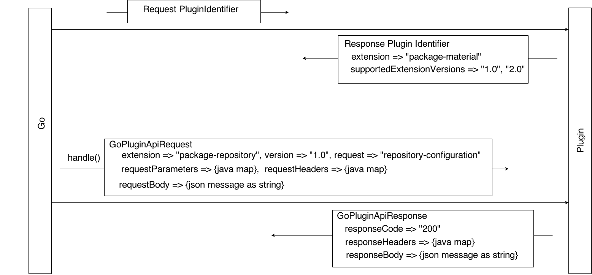

# JSON message based plugin API

## Prerequisite

If you are not already aware about Go plugin architecture and usage guide, please go through below links

[Plugins in Go](go_plugins_basics.md)

[Plugin User Guide](../../user/current/extension_points/plugin_user_guide.md)

[Go Plugin Architecture - Only if you want to extend the architecture](../4/4.4.1.md)

## Introduction

Java interface based plugin API's makes it difficult to support backward compatibility for plugins, any change in the contract would mean plugins using older contract no longer work. Although multiple versions of API interfaces and classes can be maintained but it gets messy after sometime.  JSON message based plugin API will help address this issue. Instead of implementing set of java interfaces to write a plugin, plugin authors have to implement a very thin java interface and rest of the communication between plugin and Go will be through JSON messages. Once JSON messages are used to enforce contract, incremental changes can be done without breaking older plugins. Below are some the benefits of this approach.

- Backward compatibility for plugins

- Easy to update plugin API contracts without effecting older plugins

- No need re-distribute plugin API when a new extension point is introduced.

## How does it work?

Each plugin will have to provide an instance of GoPluginIdentifier when asked by Go. GoPluginIdentifier will allow Go to identity type of extension plugin supports.
Interactions between Go and plugin for an extension point is broken down into multiple requests. Each interaction between Go and plugin will have extension name and request name, which determines
expected response from plugin.  Each extension will have

-  Unique extension name.


-  Extension versions. Go can support multiple versions of an extension point at any given point.


-  Set of request with each request having a unique name.


-  Each request has request and response message contract expressed in JSON format.


-  A request sent from Go to a plugin resembles HTTP request and has following parts.
    - extension name.
    - request name.
	- request body string as JSON format, synonymous to HTTP request body.
	- request parameters map, synonymous to HTTP request params.
	- request headers map, synonymous to HTTP request headers.


-  A response sent from a plugin to Go against a request resembles HTTP response and has following parts.
	-  response body string as JSON format, synonymous to HTTP response body.
	-  response code,  synonymous to HTTP response code
	-  response headers map,  synonymous to HTTP response headers



# What are the changes at plugin side?

Every 'JSON message based API' Go plugin will have to implement GoPlugin interface. GoPlugin interface is as shown below

``` {code}

    @GoPluginApiMarker
    public interface GoPlugin {

        public GoPluginIdentifier pluginIdentifier();

        public GoPluginApiResponse handle(GoPluginApiRequest requestMessage);

        public void initializeGoApplicationAccessor(GoApplicationAccessor goApplicationAccessor);
    }

```

***GoPluginIdentifier***
GoPluginIdentifier provide details about plugin itself (ex plugin id, extension). GoPluginIdentifier would help Go to identity type of extension supported by plugin along with extension versions supported.

***GoPluginApiRequest***
GoPluginApiRequest represents request message sent from Go to a plugin against specific request of a extension. As mentioned above, GoPluginApiRequest has request name, request body, request parameters and request headers.		

***GoPluginApiResponse***
GoPluginApiResponse represents response message sent from a plugin to Go against specific request of a extension. As mentioned above, GoPluginApiResponse has response body, response code and response headers.		

***GoApplicationAccessor***
Sometimes it is necessary for a plugin to get certain information from Go which might not be part of request sent. Precisely for this reason plugin would be provided an instance
of type GoApplicationAccessor which can help accessing set of JSON API's exposed specifically for plugins.

Go as of now supports package material extension and task extension. GoApplicationAccessor instance is not required for these extension points. More details about GoApplicationAccessor
will be provided when an extension point comes up which needs to use it.

Go plugin API provides an abstract implementation of GoPlugin called AbstractGoPlugin. It provides default implementation for "initializeGoApplicationAccessor" as below.  

``` {code}

    public abstract class AbstractGoPlugin implements GoPlugin {
        protected GoApplicationAccessor goApplicationAccessor;
        @Override
        public void initializeGoApplicationAccessor(GoApplicationAccessor goApplicationAccessor) {
            this.goApplicationAccessor = goApplicationAccessor;
        }
    }

```

Please refer [javadocs](overview.md#plugin-api-javadoc) for more details about API classes.

## Extension points supported by Go

* [Package material plugins](./package_material/package_material_plugin_overview.md)
* [SCM material plugins](./scm_material/scm_material_plugin_overview.md)
* [Task plugins](./task/task_plugin_overview.md)
* [Notification plugins](https://plugin-api.go.cd/current/notifications)
* [Authentication plugins](./authentication/authentication_plugin_overview.md)
